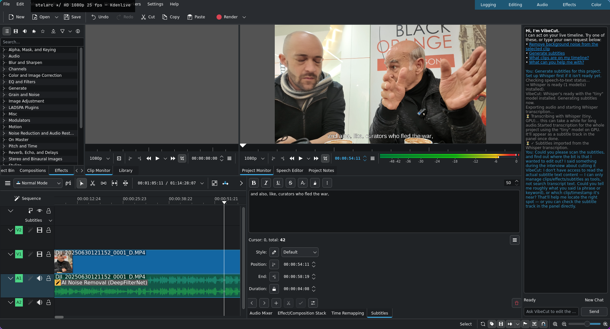

# vibecut

vibecut is an AI-scriptable fork of [Kdenlive](https://kdenlive.org) — a chat panel that can drive and extend the editor live, from natural language, instead of just triggering pre-built features through menus. Ask it to remove background noise, generate subtitles, or apply an effect, and it does it directly on your live project — the screenshot above is a real run: chat-driven AI noise removal (DeepFilterNet) and a full-project GPU-Whisper subtitle transcription, both landed on the timeline by asking for them. Video editing's answer to [vibecad](https://github.com/10-X-eng/vibecad).

Everything below this point is Kdenlive's own upstream documentation, unmodified.

---

# Kdenlive

Kdenlive is a powerful, free and open-source video editor that brings professional-grade video editing capabilities to everyone. Whether you're creating a simple family video or working on a complex project, Kdenlive provides the tools you need to bring your vision to life.

For more information about Kdenlive's features, tutorials, and community, please visit our [official website](https://kdenlive.org).

There you can also find downloads for both stable releases and experimental daily builds for Kdenlive.

## Contributing to Kdenlive

Kdenlive is a community-driven project, and we welcome contributions from everyone! There are many ways to contribute beyond coding:

- Help translate Kdenlive into your language
- Report and triage bugs
- Write documentation
- Create tutorials
- Help other users on forums and bug trackers

Visit [kdenlive.org](https://kdenlive.org) to learn more about non-code contributions.

## Developer Information

### Technology Stack

Kdenlive is written in C++ and is using these technologies and frameworks:

- **Core Framework**: MLT for video editing functionality
- **GUI Framework**: Qt and KDE Frameworks 6
- **Additional Libraries**: frei0r (video effects), LADSPA (audio effects)

### Getting Started

1. Check out our [build instructions](dev-docs/build.md) to set up your development environment
2. Familiarize yourself with the [architecture](dev-docs/architecture.md) and [coding guidelines](dev-docs/coding.md)
4. If the MLT library is new to you check out [MLT Introduction](dev-docs/mlt-intro.md)
3. Join our Matrix channel `#kdenlive-dev:kde.org` for developer discussions and support

### Contributing Code

Kdenlive's primary development happens on [KDE Invent](https://invent.kde.org/multimedia/kdenlive). While we maintain a GitHub mirror, all code contributions should be submitted through KDE's GitLab instance. For more information about KDE's development infrastructure, visit the [KDE GitLab documentation](https://community.kde.org/Infrastructure/GitLab).

### Finding Things to Work On

- Browse open issues on [KDE Invent](https://invent.kde.org/multimedia/kdenlive/-/issues), for example those labeled with [First Task](https://invent.kde.org/multimedia/kdenlive/-/issues?label_name%5B%5D=First%20Task)
- Check the [KDE Bug Tracker](https://bugs.kde.org) for reported issues
- Look for issues tagged with "good first issue" or "help wanted"

Need help getting started? Join our Matrix channel `#kdenlive-dev:kde.org` - our community is friendly and always ready to help new contributors!

Please get in touch with us before working on a task, either by commenting in the issue or through our Matrix channel.
